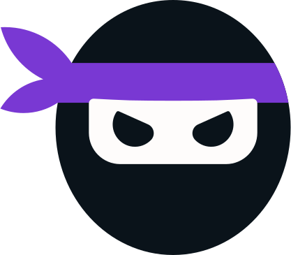

# Sockudo

<div align="center">
  
  <p>A high-performance, Pusher-compatible WebSockets server written in Rust</p>
</div>

[](https://github.com/RustNSparks/sockudo/stargazers)
[](LICENSE)
[](https://www.rust-lang.org/)

## Overview

Sockudo is a robust, memory-efficient WebSockets server that's fully compatible with the Pusher protocol, providing a seamless integration path for applications using Laravel Echo. Built from the ground up in Rust, Sockudo leverages the language's performance, memory safety, and concurrency features to deliver a high-throughput, low-latency real-time communication solution. For complete documentation please go [here](https://sockudo.app).

## Features

- **Full Pusher Protocol Compatibility**: Works seamlessly with Laravel Echo and other Pusher clients
- **Modular Architecture**: Easily swap components based on your needs
- **Horizontal Scaling**: Built-in adapters for Redis, Redis Cluster, and NATS
- **App Management**: Support for memory, MySQL, and DynamoDB backends
- **Channel Types**: Support for public, private, presence, and encrypted private channels
- **Webhooks**: Send events to your application when channels become occupied/vacated
- **Performance Monitoring**: Prometheus metrics integration
- **Rate Limiting**: Protect against abuse with configurable rate limiting
- **Caching**: Memory and Redis cache providers
- **Authentication**: Verification of channel subscriptions and user authentication

## Quick Start

### Prerequisites

- Rust 1.85 or newer
- Redis (optional, for scaling)

### Installation

1. **Clone the repository**
   ```bash
   git clone https://github.com/RustNSparks/sockudo.git
   cd sockudo
   ```

2. **Build the project**
   ```bash
   cargo build --release
   ```

3. **Run with the default configuration**
   ```bash
   ./target/release/sockudo
   ```

## Configuration

Sockudo can be configured through a JSON file or environment variables.

### Using a Config File

Create a `config.json` file in the root directory(see `options.rs` for all the configs available:

```json
{
  "adapter": {
    "driver": "redis",
    "redis": {
      "requests_timeout": 5000,
      "prefix": "sockudo",
      "redis_pub_options": {
        "url": "redis://127.0.0.1:6379"
      },
      "redis_sub_options": {
        "url": "redis://127.0.0.1:6379"
      }
    }
  },
  "app_manager": {
    "driver": "memory",
    "array": {
      "apps": [
        {
          "id": "demo-app",
          "key": "demo-key",
          "secret": "demo-secret",
          "max_connections": 1000,
          "enable_client_messages": true,
          "max_client_events_per_second": 200
        }
      ]
    }
  },
  "cache": {
    "driver": "redis",
    "redis": {
      "redis_options": {
        "url": "redis://127.0.0.1:6379",
        "prefix": "cache"
      }
    }
  },
  "port": 6001,
  "metrics": {
    "enabled": true,
    "port": 9601
  }
}
```

Then run with:

```bash
./target/release/sockudo --config=./config.json
```

### Using Environment Variables

```bash
# Basic Configuration
export PORT=6001
export HOST=0.0.0.0
export DEBUG=false

# Adapter Configuration
export ADAPTER_DRIVER=redis
export REDIS_URL=redis://127.0.0.1:6379

# Run the server
./target/release/sockudo
```

## Laravel Integration

To use Sockudo with Laravel, you'll need to update your Laravel Echo configuration:

```javascript
// resources/js/bootstrap.js
import Echo from 'laravel-echo';
import Pusher from 'pusher-js';

window.Pusher = Pusher;
window.Echo = new Echo({
    broadcaster: 'pusher',
    key: import.meta.env.VITE_PUSHER_APP_KEY,
    wsHost: import.meta.env.VITE_PUSHER_HOST ?? window.location.hostname,
    wsPort: import.meta.env.VITE_PUSHER_PORT ?? 6001,
    forceTLS: (import.meta.env.VITE_PUSHER_SCHEME ?? 'http') === 'https',
    disableStats: true,
    cluster: import.meta.env.VITE_PUSHER_APP_CLUSTER ?? 'mt1',
});
```

And in your Laravel `.env` file:

```
BROADCAST_DRIVER=pusher
VITE_PUSHER_APP_ID=demo-app
VITE_PUSHER_APP_KEY=demo-key
VITE_PUSHER_APP_SECRET=demo-secret
VITE_PUSHER_HOST=localhost
VITE_PUSHER_PORT=6001
VITE_PUSHER_SCHEME=http
VITE_PUSHER_APP_CLUSTER=mt1
```

## Using with Pusher Clients

Sockudo is fully compatible with standard Pusher client libraries, making it easy to integrate with your existing applications. Here's how to use it with the Pusher JavaScript client:

### JavaScript (Browser)

```javascript
// Initialize the Pusher client pointing to your Sockudo server
const pusher = new Pusher('demo-key', {
  wsHost: 'localhost',
  wsPort: 6001,
  enabledTransports: ['ws', 'wss'],
  disableStats: true,
  forceTLS: false,
});

// Subscribe to a channel
const channel = pusher.subscribe('my-channel');

// Listen for events on the channel
channel.bind('my-event', function(data) {
  console.log('Received event:', data);
});

// Public channels don't require authentication
// For private or presence channels:
const privateChannel = pusher.subscribe('private-channel');
const presenceChannel = pusher.subscribe('presence-channel');
```

### Node.js

```javascript
const Pusher = require('pusher-js');

const pusher = new Pusher('demo-key', {
  wsHost: 'localhost',
  wsPort: 6001,
  enabledTransports: ['ws', 'wss'],
  disableStats: true,
  forceTLS: false,
});

// Subscribe and listen to events as in the browser example
```

### PHP

```php
$options = [
  'host' => 'localhost',
  'port' => 6001,
  'scheme' => 'http',
  'encrypted' => false,
  'useTLS' => false,
];

$pusher = new Pusher\Pusher('demo-key', 'demo-secret', 'demo-app', $options);

// Trigger an event
$pusher->trigger('my-channel', 'my-event', ['message' => 'Hello World!']);
```

### Publishing Events

To publish events to your channels from your backend:

```bash
# Using curl to trigger an event
curl -X POST http://localhost:6001/apps/demo-app/events \
  -H "Content-Type: application/json" \
  -d '{
    "name": "my-event",
    "channel": "my-channel",
    "data": {"message": "Hello from Sockudo!"}
  }'
```

## API Documentation

Sockudo implements the Pusher API, supporting:

- **HTTP API**:
    - `POST /apps/{app_id}/events` - Trigger events
    - `POST /apps/{app_id}/batch_events` - Trigger multiple events
    - `GET /apps/{app_id}/channels` - Get channels info
    - `GET /apps/{app_id}/channels/{channel_name}` - Get channel info
    - `GET /apps/{app_id}/channels/{channel_name}/users` - Get users in a presence channel
    - `POST /apps/{app_id}/users/{user_id}/terminate_connections` - Terminate user connections

- **WebSocket Endpoint**:
    - `/app/{key}` - WebSocket connection endpoint

## Advanced Usage

### Scaling Horizontally

For horizontal scaling, configure the Redis adapter:

```json
{
  "adapter": {
    "driver": "redis",
    "redis": {
      "redis_pub_options": {
        "url": "redis://your-redis-server:6379"
      }
    }
  }
}
```

### Using NATS for Pub/Sub

```json
{
  "adapter": {
    "driver": "nats",
    "nats": {
      "servers": ["nats://your-nats-server:4222"],
      "prefix": "sockudo"
    }
  }
}
```

### Configuring Webhooks

```json
{
  "app_manager": {
    "array": {
      "apps": [
        {
          "id": "my-app",
          "key": "my-key",
          "secret": "my-secret",
          "webhooks": [
            {
              "url": "https://example.com/webhook",
              "event_types": ["channel_occupied", "channel_vacated"]
            }
          ]
        }
      ]
    }
  }
}
```

## Monitoring & Metrics

Sockudo exposes Prometheus metrics at `http://localhost:9601/metrics` that can be scraped to monitor:

- Active connections
- Messages sent/received
- Channel statistics
- Memory usage
- Adapter performance

## Architecture

Sockudo's architecture is organized around these key components:

- **Adapter**: Handles connection management and broadcasting
- **App Manager**: Manages application configuration and authentication
- **Channel Manager**: Handles channel subscriptions and presence state
- **Cache Manager**: Provides caching capabilities
- **Metrics**: Collects and exposes performance metrics
- **Webhook Integration**: Sends webhook events to configured endpoints
## License

This project is licensed under the AGPL 3.0 License - see the [LICENSE](LICENSE) file for details.

## Acknowledgements

- Inspired by Laravel Reverb and the Pusher protocol
- Built with the Laravel ecosystem in mind
- Special thanks to the Rust community for their excellent libraries

---

## Troubleshooting

### Common Issues

#### Connection Refused
- Check that the server is running and the firewall allows connections to the configured port
- Verify that the host and port in your Laravel Echo configuration match Sockudo's configuration

#### Authentication Failures
- Ensure that your app key and secret match between Laravel and Sockudo
- Check that your auth endpoint is properly configured and responding

#### Redis Connection Issues
- Verify that Redis is running and accessible
- Check Redis connection settings in your config file

For more detailed troubleshooting, check the logs by running Sockudo with the `DEBUG=true` environment variable.

---

Feel free to reach out with any questions or feedback by opening an issue on GitHub!
