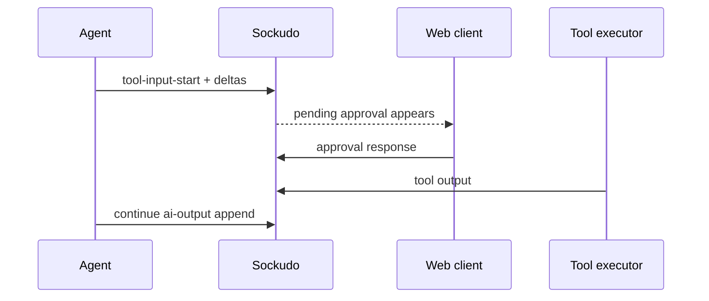

Sockudo AI Transport is provider-neutral. Sockudo carries ordered, durable run state; your agent
chooses how to call the model and converts provider output into AI SDK UI message chunks.

The JavaScript SDK has two integration families:

| Integration              | Import                            | Best for                                                                                                    |
| ------------------------ | --------------------------------- | ----------------------------------------------------------------------------------------------------------- |
| Vercel AI SDK transport  | `@sockudo/ai-transport/vercel`    | Apps already using `ai`, `streamText`, `useChat`, Vue, React, or Svelte AI SDK UI primitives.               |
| Direct provider adapters | `@sockudo/ai-transport/providers` | Workers that call OpenAI, Anthropic, OpenAI-compatible HTTP/SSE endpoints, or local model servers directly. |
| Core codec transport     | `@sockudo/ai-transport`           | Custom model protocols, custom UI projections, or non-Vercel message shapes.                                |

## Credits

Sockudo AI Transport is heavily inspired by [Ably AI Transport](https://ably.com/docs/ai-transport),
and Ably's public AI Transport docs and SDK were the main product inspiration for this layer. The
Sockudo implementation maps those ideas onto Sockudo Protocol V2, durable history, versioned
messages, presence, push, and the `@sockudo/client` SDK in this monorepo.

## Provider flow

<div
  className="provider-flow-diagram not-prose"
  role="img"
  aria-label="Provider flow showing how the user, Sockudo channel, agent worker, model provider, and durable stores cooperate during an AI run."
>
  <div className="provider-flow-lanes" aria-hidden="true">
    <span>User client</span>
    <span>Sockudo channel</span>
    <span>Agent worker</span>
    <span>Model provider</span>
    <span>Stores</span>
  </div>
  <ol className="provider-flow-steps">
    <li>
      <span>01</span>
      <div>
        <strong>User starts a run</strong>
        <p>
          {
            "The client publishes ai-input create into the private AI session channel."
          }
        </p>
      </div>
      <code>User -&gt; Sockudo</code>
    </li>
    <li>
      <span>02</span>
      <div>
        <strong>Sockudo persists intent</strong>
        <p>
          {
            "The channel records the user message and run start before provider work begins."
          }
        </p>
      </div>
      <code>Sockudo -&gt; stores</code>
    </li>
    <li>
      <span>03</span>
      <div>
        <strong>Agent streams provider output</strong>
        <p>
          {
            "The worker calls the selected model provider and receives deltas, tool calls, and finish signals."
          }
        </p>
      </div>
      <code>Agent &lt;-&gt; provider</code>
    </li>
    <li>
      <span>04</span>
      <div>
        <strong>Every mutation becomes realtime state</strong>
        <p>
          {
            "The worker creates ai-output and appends or updates the message through Sockudo."
          }
        </p>
      </div>
      <code>Agent -&gt; Sockudo</code>
    </li>
    <li>
      <span>05</span>
      <div>
        <strong>Clients recover from the channel</strong>
        <p>
          {
            "Live clients receive rollups; refreshed clients rewind history and reconstruct the transcript."
          }
        </p>
      </div>
      <code>Sockudo -&gt; clients</code>
    </li>
  </ol>
</div>

The provider never needs to know about connection recovery, rewind, history cursors, branch trees,
presence, or multi-device fanout. It streams chunks. Sockudo makes those chunks durable and
observable.

## Vercel AI SDK

Use Vercel AI SDK when you want provider packages, tool calling, and UI message streams to stay in
the `ai` ecosystem.

```ts
// server/api/chat.post.ts
import { streamText, toUIMessageStream } from "ai";
import { createServerTransport } from "@sockudo/ai-transport/vercel";
import { realtimeClient } from "../utils/sockudo";

export default defineEventHandler(async (event) => {
  const body = await readBody(event);

  const transport = createServerTransport({
    client: realtimeClient(),
    channelName: body.channelName,
  });

  const run = transport.newTurn({
    runId: body.runId,
    invocationId: body.invocationId,
    inputEventId: body.inputEventId,
    clientId: body.clientId,
    onCancel(request) {
      return (
        request.filter.all === true ||
        request.matchedTurnIds.includes(body.runId)
      );
    },
  });

  event.waitUntil?.(
    (async () => {
      await run.start();
      const result = streamText({
        model: "openai/gpt-5-mini",
        instructions: "You are a concise incident-room assistant.",
        prompt:
          body.messages
            .at(-1)
            ?.parts?.map((part) => part.text ?? "")
            .join("") ?? "",
        abortSignal: run.abortSignal,
      });
      await run.streamResponse(toUIMessageStream({ stream: result.stream }));
      await run.end("complete");
      transport.close();
    })(),
  );

  setResponseStatus(event, 202);
});
```

The frontend can use the Vercel-compatible transport in React, Vue, or Svelte.

```ts
import { useChat } from "@ai-sdk/vue";
import { provideChatTransport } from "@sockudo/ai-transport/vercel/vue";

const provider = provideChatTransport({
  api: "/api/chat",
  channelName: "private-ai:user-42:sess-01J",
  client: sockudoClient,
  clientId: "user-42",
});

const { sendMessage } = useChat({
  id: "private-ai:user-42:sess-01J",
  transport: provider.chatTransport.value,
});

await sendMessage({ text: "Summarize the last deploy failure." });
```

## AI SDK 7 feature coverage

AI SDK 7 does not require a separate Sockudo server mode. The compatibility surface is the AI SDK UI
message stream: Sockudo persists ordered UI chunks, run lifecycle events, approval responses, and
metadata, while the app runtime keeps provider calls, tool execution, and agent-local state.

| AI SDK capability                         | Sockudo behavior                                                                                                                                       |
| ----------------------------------------- | ------------------------------------------------------------------------------------------------------------------------------------------------------ |
| Reasoning controls                        | Pass model options through `streamText`; Sockudo carries emitted reasoning text and reasoning-file chunks.                                             |
| Tool context and runtime context          | Keep context on the trusted worker. Publish only safe derived metadata, never provider secrets or raw tool credentials.                                |
| Provider file and skill uploads           | Let the provider own uploads and references. Sockudo can carry file, source, reasoning-file, or custom chunks that point at externally stored assets.  |
| MCP Apps and custom UI parts              | Preserve `custom` chunks and provider metadata. Rendering app iframes or custom widgets remains a client responsibility.                               |
| Tool approvals                            | Persist approval requests and responses as normal run state. The app still owns approval policy, signature checks, and tool execution authorization.   |
| `WorkflowAgent` and `HarnessAgent` output | Stream their UI-message output through `toUIMessageStream`. Use the workflow store for agent checkpoints and Sockudo for transcript/reconnect history. |
| Realtime voice                            | Keep low-latency audio on the provider's realtime channel. Mirror transcripts, tool calls, approvals, and final state through Sockudo.                 |
| Video generation                          | Store generated media outside Sockudo and publish progress, asset URLs, thumbnails, or final file parts through the AI session channel.                |
| Telemetry and lifecycle callbacks         | Correlate AI SDK spans with `channelName`, `runId`, and `invocationId`. Sockudo metrics continue to describe transport, history, and fanout health.    |

## Direct provider support

The `@sockudo/ai-transport/providers` entry point supports these built-in adapters:

| Provider path                       | Function                                                                  | Notes                                                           |
| ----------------------------------- | ------------------------------------------------------------------------- | --------------------------------------------------------------- |
| OpenAI-compatible HTTP/SSE          | `streamOpenAICompatibleText`                                              | Uses Chat Completions-compatible `/chat/completions` streaming. |
| OpenAI-compatible reusable provider | `createOpenAICompatibleProvider`                                          | Good for named provider registries.                             |
| OpenAI SDK Chat Completions         | `streamOpenAIChatCompletion` / `createOpenAISdkProvider`                  | Uses a structural subset of the official OpenAI SDK.            |
| OpenAI SDK Responses                | `streamOpenAIResponse` / `createOpenAISdkProvider({ mode: "responses" })` | Maps output text and tool argument deltas to UI chunks.         |
| Anthropic SDK Messages              | `streamAnthropicMessage` / `createAnthropicSdkProvider`                   | Maps text, thinking, tool use, and finish reasons.              |

OpenAI-compatible presets are:

| Name         | Default base URL                        |
| ------------ | --------------------------------------- |
| `openai`     | `https://api.openai.com/v1`             |
| `openrouter` | `https://openrouter.ai/api/v1`          |
| `groq`       | `https://api.groq.com/openai/v1`        |
| `togetherai` | `https://api.together.xyz/v1`           |
| `fireworks`  | `https://api.fireworks.ai/inference/v1` |
| `deepseek`   | `https://api.deepseek.com`              |
| `perplexity` | `https://api.perplexity.ai`             |
| `mistral`    | `https://api.mistral.ai/v1`             |
| `xai`        | `https://api.x.ai/v1`                   |
| `ollama`     | `http://127.0.0.1:11434/v1`             |
| `lmstudio`   | `http://127.0.0.1:1234/v1`              |

Local providers such as Ollama and LM Studio may omit `apiKey` when the local server does not
require one.

## OpenAI-compatible HTTP example

```ts
import {
  createOpenAICompatibleProvider,
  runDirectLlmTurn,
} from "@sockudo/ai-transport/providers";

const provider = createOpenAICompatibleProvider({
  provider: "groq",
  apiKey: process.env.GROQ_API_KEY,
  model: "llama-3.3-70b-versatile",
});

await runDirectLlmTurn(turn, provider, {
  prompt: "Write a remediation plan for a Redis fanout incident.",
  maxOutputTokens: 800,
});
```

## OpenAI SDK examples

```ts
import OpenAI from "openai";
import {
  createOpenAISdkProvider,
  runDirectLlmTurn,
} from "@sockudo/ai-transport/providers";

const openai = new OpenAI({ apiKey: process.env.OPENAI_API_KEY });

const chatProvider = createOpenAISdkProvider({
  client: openai,
  mode: "chat",
  model: "gpt-4.1-mini",
});

await runDirectLlmTurn(turn, chatProvider, {
  messages: [
    { role: "system", content: "Answer as a production engineer." },
    { role: "user", content: "Why did reconnect recovery fail?" },
  ],
});
```

```ts
const responsesProvider = createOpenAISdkProvider({
  client: openai,
  mode: "responses",
  model: "gpt-5-mini",
});

await runDirectLlmTurn(turn, responsesProvider, {
  prompt: "Explain the latest channel history page in plain English.",
  body: {
    reasoning: { effort: "low" },
  },
});
```

## Anthropic SDK example

```ts
import Anthropic from "@anthropic-ai/sdk";
import {
  createAnthropicSdkProvider,
  runDirectLlmTurn,
} from "@sockudo/ai-transport/providers";

const anthropic = new Anthropic({ apiKey: process.env.ANTHROPIC_API_KEY });

const provider = createAnthropicSdkProvider({
  client: anthropic,
  model: "claude-sonnet-4-5",
  system: "Be concise and include risk levels.",
});

await runDirectLlmTurn(turn, provider, {
  prompt: "Audit this failed push notification delivery chain.",
});
```

## Provider registry

Use a registry when the UI lets a user or tenant select a model provider.

```ts
import {
  createAnthropicSdkProvider,
  createDirectLlmProviderRegistry,
  createOpenAICompatibleProvider,
} from "@sockudo/ai-transport/providers";

const providers = createDirectLlmProviderRegistry({
  groq: createOpenAICompatibleProvider({
    provider: "groq",
    apiKey: process.env.GROQ_API_KEY,
    model: "llama-3.3-70b-versatile",
  }),
  local: createOpenAICompatibleProvider({
    provider: "ollama",
    model: "llama3.2",
  }),
  anthropic: createAnthropicSdkProvider({
    client: anthropic,
    model: "claude-sonnet-4-5",
  }),
});

const stream = await providers.streamText("local", {
  prompt: "Return a JSON incident summary.",
});
```

## Custom provider

Any provider that returns `ReadableStream<VercelOutput>` can participate.

```ts
import type { DirectLlmProvider } from "@sockudo/ai-transport/providers";

const provider: DirectLlmProvider = {
  async streamText(request) {
    const words = (request.prompt ?? "").split(/\s+/);

    return new ReadableStream({
      start(controller) {
        controller.enqueue({ type: "start" });
        controller.enqueue({ type: "text-start", id: "answer" });
        for (const word of words) {
          controller.enqueue({
            type: "text-delta",
            id: "answer",
            delta: `${word} `,
          });
        }
        controller.enqueue({ type: "text-end", id: "answer" });
        controller.enqueue({ type: "finish", finishReason: "stop" });
        controller.close();
      },
    });
  },
};
```

## Tool calling and human approval

Tool calls are just streamed UI message chunks. The transport persists every tool-input delta and
the final tool state, so a user can approve from another tab or after a reconnect.



For AI SDK 7 approval flows, treat the request and response as part of the transcript:

1. The agent streams a `tool-approval-request` chunk with a stable approval id and tool call id.
2. Sockudo stores that request on the `ai-output` mutable message and fans it out to every attached
   client.
3. The client records an approval response on the assistant tool part. The Vercel chat transport
   diffs the optimistic message overlay and publishes a `tool-approval-response` input.
4. The worker verifies the response, runs or denies the tool, then appends `tool-result`,
   `tool-result-error`, or `output-denied` state.

Use channel auth and V2 capabilities to decide who can approve. If the provider supplies approval
signatures or automatic-approval markers, keep them with the approval chunk so the worker can verify
them before executing the tool. Do not treat a client-rendered button click as sufficient authority
by itself.

## Realtime voice and generated media

AI SDK realtime voice sessions are optimized for provider-native WebSocket or WebRTC media paths.
Sockudo should not proxy high-rate PCM frames, microphone buffers, or generated video bytes through
mutable-message appends. Use Sockudo as the durable control and transcript plane:

- publish session start, model, voice, and participant metadata
- append transcript deltas, final transcript text, tool calls, and approval state
- fan out presence for the user, agent, and handoff devices
- publish push notifications or completion events when the media job finishes
- store recordings, uploaded files, thumbnails, and generated videos in object storage, then publish
  references as file, source, or custom chunks

This keeps reconnect, rewind, audit, and multi-device UI recovery in Sockudo without putting
latency-sensitive media on the same path as durable chat history.

## Choosing an integration

| You have                                 | Use                                                                    |
| ---------------------------------------- | ---------------------------------------------------------------------- |
| Vercel AI SDK `streamText` already wired | `@sockudo/ai-transport/vercel`                                         |
| A provider with OpenAI-compatible SSE    | `createOpenAICompatibleProvider`                                       |
| Official OpenAI SDK                      | `createOpenAISdkProvider`                                              |
| Official Anthropic SDK                   | `createAnthropicSdkProvider`                                           |
| A custom internal model gateway          | `DirectLlmProvider`                                                    |
| A non-Vercel UI model                    | Core codec API from `@sockudo/ai-transport`                            |
| AI SDK agent or workflow output          | Convert to UI message chunks, then stream through the Vercel transport |
| Realtime voice or generated video        | Provider media path plus Sockudo transcript/control events             |

Keep provider API keys server-side. Browser clients should only receive Sockudo public app keys,
private/presence auth responses, and short-lived Protocol V2 capability tokens.
