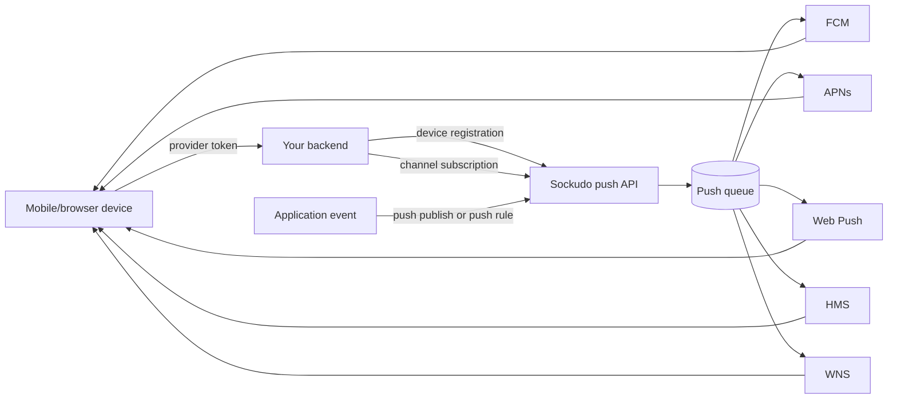
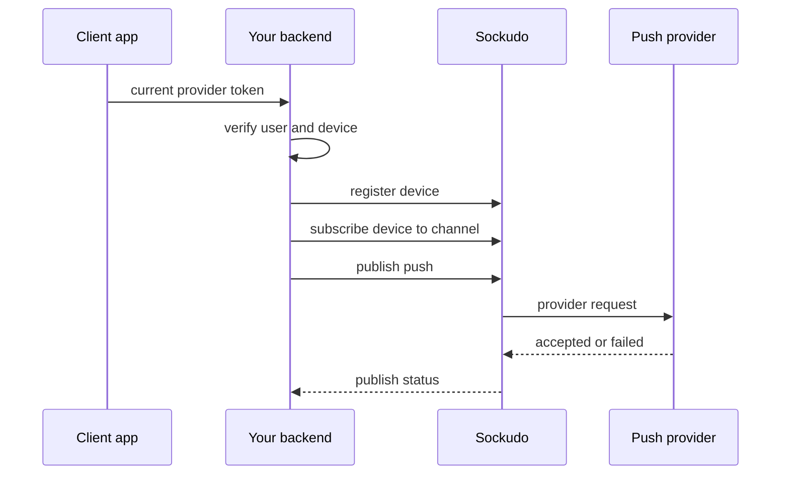

Push notifications are a core part of Sockudo. WebSockets deliver realtime messages to connected clients; push notifications reach devices that are offline, backgrounded, rate-limited by the OS, or outside the active channel session.



## Concepts

| Concept | Meaning |
| --- | --- |
| Device registration | A device record tied to a provider token and optional `client_id`. |
| Activation | A safe workflow for clients to register or update devices through your backend. |
| Channel subscription | A mapping between a device and a realtime channel for push targeting. |
| Credential | Provider configuration for FCM, APNs, Web Push, HMS, or WNS. |
| Publish | A push request accepted by Sockudo and fanned out asynchronously. |
| Publish status | The operational record for accepted, scheduled, dispatched, failed, or cancelled push work. |

## Provider support

| Provider | Platforms | Credentials | Notes |
| --- | --- | --- | --- |
| FCM | Android, web, cross-platform app backends | Service account JSON and optional project ID | Best default for Android and Firebase-backed apps. |
| APNs | iOS, iPadOS, macOS, watchOS, tvOS, visionOS | Team ID, key ID, bundle ID, `.p8` private key, environment | Use sandbox for development tokens and production for App Store/TestFlight tokens. |
| Web Push | Browsers and installed PWAs | VAPID subject, public key, private key | Payload size and browser support vary; store endpoint metadata with the device. |
| HMS | Huawei devices | App credentials | Use when shipping to Huawei Mobile Services environments. |
| WNS | Windows apps | WNS credentials | Use for Microsoft Store/Windows notification channels. |

Sockudo normalizes admission, idempotency, queueing, retries, status retention, and feedback. Provider-specific limits still apply after the request leaves Sockudo.

## Admission readiness

Sockudo fails closed before accepting publish work it already knows cannot be processed safely. The
push publish API requires a healthy push queue, production-safe storage, local pipeline workers, and
local provider-worker capability. Raw FCM/APNs/Web Push/HMS/WNS recipients require the matching
provider worker in this process. Channel, client, and device targets require at least one active
provider worker without scanning large channel subscription sets during admission; shard-path
publishes also require a local shard worker. The planner still resolves exact devices
asynchronously.

In `mode = "production"`, `storage_driver = "memory"` and `queue_driver = "memory"` are rejected
unless `allow_memory_drivers = true` or `PUSH_ALLOW_MEMORY_DRIVERS=true` is set explicitly. Memory
drivers are node-local and lose state on restart or dead-node loss.

Readiness failures return `503`. Queue pressure returns `429` with `Retry-After`. Quota rejection
persists a terminal `quota_exceeded` publish status and idempotency record without appending publish
log work or enqueueing the pipeline.

## Cluster queue delivery guarantees

Push queue delivery is at-least-once. Accepted publish work is durable before the API returns, and
every delivery result is idempotently applied by feedback workers. A provider send can still be
duplicated if a worker crashes after the provider accepts the request but before `push.results.v1`
is produced or before the original delivery batch is acknowledged. Sockudo keeps the duplicate
window bounded with stable delivery idempotency keys, deterministic retry context, and duplicate
feedback suppression, but it does not claim exactly-once provider delivery.

In monolith deployments, each node consumes only stages it can process. Planner, shard, feedback,
retry, and dead-letter stages are consumed only by nodes with the matching local worker enabled.
Provider delivery stages such as `push.delivery.fcm.v1` are consumed only by nodes whose provider
worker is active and credential-ready at boot. Changing provider capability or credentials requires
worker restart; stored credentials are reloaded when a supervised provider worker restarts.

External queue adapters pull broker messages into a bounded node-local ready/pending handoff before
Sockudo workers ack, nack, or dead-letter them. If the local worker does not finish before the local
lease timeout, the adapter requeues the envelope with backoff. Queue health and lag reported by the
generic queue manager adapter distinguish this node's local pull-ahead depth and oldest actionable
handoff age from broker-wide backlog, so operators can alert on Sockudo-owned worker staleness with
`sockudo_push_queue_oldest_age_seconds` and use backend-native tools for deeper broker visibility.
The monolith repair worker also scans durable publish-log entries that remain `queued` past
`push.repair_min_age_secs` and recreates missing `push.publish.v1` work if an accepted publish
lost its queue message before planning began.

## Retry and dead letters

Provider throttling, 5xx responses, and transport failures are classified as retryable provider,
quota, or network failures. Feedback workers schedule retry entries on `push.retry.v1` with the
original delivery job context, a deterministic retry idempotency key, the next attempt number, the
first-attempt timestamp, retry deadline, and the provider error class. Retry scheduler workers
consume only due entries, respect provider `Retry-After` deadlines when configured, and otherwise
use bounded exponential backoff with deterministic jitter.

Retries stop at the earliest of `max_attempts`, `max_elapsed_secs`, or the publish/job
`expires_at_ms`. Exhausted retry work is emitted to `push.deadletters.v1` and the publish status
moves to `dead_lettered` unless some deliveries already succeeded, in which case it becomes
`partially_succeeded`. If the publish expiry passes before a retry can run, the publish moves to
`expired`. Pending retry work increments `retryScheduled`; retry dispatch increments
`retryAttempted`; `dispatched` counts terminal provider outcomes so retry attempts do not inflate
completion accounting.

Publish timing is enforced at delivery time. `notBeforeMs` delays provider dispatch; provider
workers split mixed due/future batches so due jobs are not blocked behind future jobs. `expiresAtMs`
prevents late sends; expired delivery jobs are recorded as `expired` and are not sent to providers.
Retry scheduling preserves the original timing window and does not run past publish or job expiry.

Operators inspect aggregate status with `GET /apps/{appId}/push/publish/{publishId}/status`, retry
and dead-letter queue lag through the health/backpressure surfaces, and metrics such as
`sockudo_push_queue_oldest_age_seconds{stage=...,state=...}`,
`sockudo_push_retry_scheduled_total`, `sockudo_push_retry_attempted_total`,
`sockudo_push_retry_dead_lettered_total`, `sockudo_push_retry_malformed_total`, and
`sockudo_push_provider_failures_total{failure_class=...}`.

Lifecycle safety checks expose `sockudo_push_invariant_violations_total{invariant=...}`. The bounded
`status_transition` label means a stale, non-monotonic status write was ignored. The metric does
not include payloads, device tokens, or provider credentials.

Publish-status mutations use storage-level compare-and-swap in every backend. Short-lived write
contention increments `sockudo_push_status_cas_conflicts_total{component=...}` and is retried with
a fixed bound. `sockudo_push_status_cas_exhausted_total{component=...}` means that bound was
exhausted; the worker returns a structured error instead of silently accepting a lost update.
Component labels come from a fixed internal set and neither metric includes payloads, tokens,
credentials, app IDs, or publish IDs.

All installations must stop old push admission and worker processes before starting
revision-aware workers; do not run old blind status writers alongside them. PostgreSQL and MySQL
must apply the push schema-version-2 migration while workers are stopped. DynamoDB, SurrealDB, and
ScyllaDB store the revision in the status document envelope and need no table migration, but still
require the same drain-and-replace deployment boundary.

Upgrade note: provider workers now enqueue internal `deliveryFeedback` payloads on
`push.results.v1` so feedback workers can schedule retries with replayable job context. Older
`deliveryResult` payloads are still accepted, but retryable legacy results without job context are
dead-lettered instead of being retried blindly.

## Retention and cleanup

The cleanup worker runs in monolith deployments when `push.cleanup_interval_secs > 0`. It removes
terminal publish statuses older than `push.publish_status_ttl_days`, delivery events and operator
invalidation events older than `push.analytics_retention_days`, expired idempotency records, and
expired scheduler locks. It does not delete active scheduled jobs, active retry work, credentials,
templates, or active device registrations.

Cleanup is incremental: each tick is bounded by `push.cleanup_batch_size` per category and
`push.cleanup_max_deleted_per_tick` overall. See [Push operations](/docs/server/push-operations)
for metrics, alerts, and outage runbooks.

## Device invalidation safety

Sockudo deletes or terminally invalidates a device only for device-specific terminal failures:

- FCM `UNREGISTERED`, `registration-token-not-registered`, or an `INVALID_ARGUMENT` response that
  specifically identifies the registration token as invalid.
- APNs `BadDeviceToken` or `Unregistered`.
- Web Push, HMS, and WNS expired subscription/channel responses such as `404` or `410`.

Provider-wide failures do not increment device failure counts and do not delete devices. This
includes FCM `SENDER_ID_MISMATCH` or project mismatch, APNs topic/environment/auth failures, Web
Push VAPID/auth failures, provider `429` quota responses, provider `5xx` responses, DNS/TLS/network
transport failures, and caller payload errors. These outcomes still update publish status, schedule
retry or dead-letter work according to the retry policy, and emit classified metrics.

Operators should treat `credential_auth` and project/topic mismatch failures as credential or
configuration incidents: rotate or fix the provider credential, project id, APNs topic/environment,
or VAPID configuration, then inspect `GET /apps/{appId}/push/deadLetters` and replay entries marked
`replayable` or republish from the original source as appropriate. Do not purge device registries
for these classes. The `sockudo_push_provider_failures_total{failure_class=...}` metric separates
`device_terminal`, `provider_transient`, `provider_quota`, `credential_auth`, `caller_payload`,
`network_transport`, and `unknown` failures. The `sockudo_push_token_invalidation_guard_total`
metric and `token-invalidation-guard` meta event fire when a publish crosses the built-in
invalidation spike threshold.

## Configure providers

```toml
[push]
storage_driver = "postgres"
queue_driver = "redis"
allow_memory_drivers = false
fcm_enabled = true
apns_enabled = true
publish_status_ttl_days = 30
analytics_retention_days = 30
scheduler_interval_secs = 5
cleanup_interval_secs = 300
cleanup_batch_size = 1000
cleanup_max_deleted_per_tick = 100000

# Runtime env for FCM monolith workers:
# PUSH_FCM_ENABLED=true
# PUSH_FCM_SERVICE_ACCOUNT_JSON_PATH=/run/secrets/fcm-service-account.json
# PUSH_FCM_PROJECT_ID is optional when the service account JSON has project_id.

# Runtime env for APNs monolith workers:
# PUSH_APNS_ENABLED=true
# PUSH_APNS_TOPIC=com.example.app
# PUSH_APNS_PRIVATE_KEY_PATH=/run/secrets/AuthKey_KEYID12345.p8
```

## Register devices

Clients should call your backend. Your backend authenticates the user, validates ownership, and forwards to Sockudo with server credentials.

```ts
app.post("/api/push/devices", async (req, res) => {
  const user = requireUser(req);

  const result = await sockudo.activateDevice({
    device_id: req.body.device_id,
    client_id: user.id,
    platform: req.body.platform,
    provider_token: req.body.provider_token,
  });

  res.json(result);
});
```

Device IDs should be stable per installation. Provider tokens can rotate; update the registration
when the platform SDK gives you a new token.

## Subscribe devices to channels

```ts
await sockudo.upsertChannelPushSubscription({
  device_id: "ios-device-1",
  client_id: "user-42",
  channel: "orders",
});
```

Use the same authorization model as realtime channel subscription. If the user cannot subscribe to `private-orders` over WebSocket, they should not subscribe a device to `private-orders` for push.



## Publish

```ts
const response = await sockudo.publishPush({
  recipients: [
    { type: "channel", channel: "orders" },
    { type: "client", client_id: "user-42" },
  ],
  payload: {
    title: "Order updated",
    body: "Order ord_123 is packed",
    data: {
      order_id: "ord_123",
      channel: "orders",
    },
  },
  idempotency_key: "push-order-ord_123-packed",
  sync: false,
});

console.log(response.publish_id);
```

Use `sync: false` for most production traffic. Async admission returns quickly, then workers fan out
to providers and update publish status records.

### Payload fidelity, templates, and overrides

Publish responses include `renderedPayloads`, one provider-specific preview for FCM, APNs, Web
Push, HMS, and WNS. The same renderer is used by admission and dispatch. Provider workers send the
previewed provider payload, except for runtime-only fields such as provider tokens, APNs device
tokens, generated authorization headers, and provider request IDs.

`providerOverrides` are provider-specific complete payloads. When an override exists for a
provider, it replaces the generic payload mapping for that provider. APNs override headers become
APNs request headers, Web Push `headers.ttl`, `headers.urgency`, and `headers.topic` become Web
Push request headers, and FCM/HMS/WNS overrides are sent as the provider body with runtime recipient
tokens added by the worker. Overrides are validated and size-checked before dispatch.

Templates are resolved during publish admission. A `payload.templateId` must reference an existing
template; missing templates fail the publish request before work is accepted. Sockudo selects the
template locale from `payload.templateData.locale`, falling back from exact locale to language and
then the template's `defaultLocale`. Template fields fill missing payload fields, while explicit
payload fields win. Template provider overrides are applied first and request `providerOverrides`
win when both define the same provider. The resolved payload is stored in the accepted publish work,
so later template edits do not change queued delivery or retry attempts.

Template placeholders use bounded `{{ data.path }}` substitutions against `payload.templateData`.
Missing placeholders fail admission with a precise invalid-template error; objects and arrays are
not coerced into strings.

## Delayed delivery and cancellation

```ts
const delayed = await sockudo.publishPush({
  notBeforeMs: Date.parse("2026-05-19T18:00:00Z"),
  expiresAtMs: Date.parse("2026-05-19T18:10:00Z"),
  recipients: [{ type: "client", client_id: "user-42" }],
  payload: { title: "Reminder", body: "Your room starts soon" },
});
```

The public HTTP API does not expose a separate schedule-create endpoint. Use
`POST /apps/{appId}/push/publish` with `notBeforeMs` for delayed delivery. Persisted scheduled jobs
created by internal scheduler/store integrations can be cancelled before emission with
`DELETE /apps/{appId}/push/scheduled/{jobId}`.

## Channel-triggered push rule

Push rules convert normal channel events into push work. This is useful for product events and AI
agent completion notifications.

```toml
[[push_rules]]
enabled = true
channel_pattern = "notifications:*"
event_filter = ["agent-complete", "order-ready"]
rate_limit_per_second = 100

[push_rules.payload_mapping]
title_field = "title"
body_field = "body"
template_data_field = "data"
include_remaining_fields = true
```

```json
{
  "name": "agent-complete",
  "channel": "notifications:user-42",
  "data": {
    "title": "Agent finished",
    "body": "Your answer is ready",
    "data": {
      "session_id": "sess_01J"
    }
  }
}
```

## Capacity planning

Push fanout has a different bottleneck profile than WebSocket fanout:

- provider rate limits
- token invalidation churn
- per-platform payload size limits
- queue depth and worker concurrency
- status retention writes
- scheduled publish scans
- provider callback volume

Before a campaign, test admission and provider dispatch separately. A healthy API admission rate does not prove provider delivery capacity.

## Benchmarking

Use the repository push scripts for repeatable scenarios:

```bash
node scripts/push-benchmark.mjs \
  --host http://127.0.0.1:6001 \
  --app-id app-id \
  --key app-key \
  --secret app-secret \
  --devices 10000 \
  --channels orders \
  --publish-rate 100
```

Track accepted publishes, queue depth, provider dispatch latency, provider error classes, and status write latency.

The Criterion benchmark `push_retry_scheduler/memory_drain_100k_due_retry_entries_budget_lt_5s`
seeds and drains 100k due retry entries through the memory queue/store path as a regression guard
for retry scheduling overhead.

## Troubleshooting

| Symptom | Check |
| --- | --- |
| `202` returned but no notification | Inspect publish status and provider errors. |
| APNs rejects token | Verify bundle ID, environment, topic, and token freshness. |
| Web Push rejected | Verify VAPID subject and key pair. |
| FCM unauthorized | Verify service account and project. |
| Channel push misses users | Verify channel push subscriptions and `client_id` mapping. |
| Large push is rejected | Check platform payload limits and remove nonessential data. |
| Push publish returns `503` | Check push queue health, memory-driver production guard, provider feature flags, provider credentials, and dispatch worker count. |
| Push publish returns `429` | Check publish-log, shard, delivery result, retry, dead-letter, active provider delivery queue depth, and `sockudo_push_queue_oldest_age_seconds`. |
| Publish remains `dispatching` | Check retry scheduler workers, `push.retry.v1` lag, dead-letter lag, and provider retry-after deadlines. |
| Publish becomes `dead_lettered` | Inspect `GET /apps/{appId}/push/deadLetters`, retry metrics, provider outage history, and `max_attempts`/`max_elapsed_secs`; replay only entries marked `replayable`. |
| Cleanup failures increase | Check `sockudo_push_cleanup_errors_total`, store connectivity, and batch limits. |

Push payloads should wake the app and include stable IDs. Fetch authoritative application state after the user opens the notification.
