# Sockudo Push Capacity Model And Fanout Architecture

Date: 2026-04-30
Status: Binding pre-implementation architecture for Sockudo 4.5 push

This document is binding for all subsequent Sockudo push implementation prompts.
Runtime code, schemas, queue abstractions, docs, and benchmark claims must remain
consistent with this capacity model unless a later accepted ADR explicitly
replaces it.

## Scope

Sockudo push uses a durable queue-based pipeline. The Publish API is an
admission-control surface, not a synchronous provider delivery path. It validates
requests, records durable status, publishes work to the log, and returns
`202 Accepted` with a stable `publish_id`.

The architecture separates:

- request acceptance from fanout planning
- fanout planning from provider dispatch
- provider dispatch from feedback processing
- storage-backed status from broker-specific acknowledgement behavior

## Architecture

```mermaid
flowchart LR
    A["Publish API<br/>validate, rate-limit, persist status"] --> B["Publish Log<br/>partition: hash(app_id, publish_id)"]
    B --> C["Fanout Planner<br/>stateless consumers"]
    C -->|"fanout < threshold"| D["Provider Batch Jobs"]
    C -->|"fanout >= threshold"| E["Shard Jobs<br/>cursor/key ranges"]
    E --> F["Shard Workers<br/>bounded token pages"]
    F --> D
    D --> G["Delivery Jobs Queue<br/>provider-specific topics"]
    G --> H["Provider Worker Pools<br/>tenant fair + pooled provider connections"]
    H --> I["Delivery Results Queue"]
    I --> J["Feedback Processor<br/>device state, cleanup, counters, metrics"]
    J --> K["[meta]log:push"]
    J --> L["Status Store"]
    C --> L
    H --> L
```

### Required Stages

| Stage | Responsibility | Durability boundary | Idempotency key |
| --- | --- | --- | --- |
| Publish API | Validate auth, request shape, rate limits, quota, payload size, expiry, and provider eligibility. Persist initial status, publish event, return `202`. | Status store plus publish log append must both complete before `202`. | `(app_id, publish_id)` |
| Publish Log | Durable append-only topic partitioned by `hash(app_id, publish_id)`. | Broker retention plus status-store replay cursor. | broker message key |
| Fanout Planner | Stateless consumers choose fast path or shard path, enforce tenant/provider quotas, and emit delivery or shard jobs. | Planner jobs are replayable from publish log. | `(app_id, publish_id, plan_version)` |
| Delivery Jobs Queue | Provider-specific durable topics carrying bounded batches. | Broker ack/redelivery and push-layer attempt store. | `(app_id, publish_id, provider, batch_id)` |
| Provider Worker Pools | Weighted-fair tenant scheduling, provider connection pools, retry-after handling, circuit breakers, and attempt recording. | Attempt state is stored before retry or final classification. | `(app_id, publish_id, provider, batch_id, attempt)` |
| Delivery Results Queue | Durable feedback events from providers. | Result queue plus feedback-event store. | provider message id or token hash plus attempt id |
| Feedback Processor | Device state updates, stale token cleanup, publish counters, metrics, dead letters, and `[meta]log:push`. | Status/device updates must be idempotent and replay-safe. | result event id |

## Fanout Regimes

Two fanout regimes are required. Implementations must keep the thresholds
configurable and must report which regime each publish used.

| Regime | Trigger | Planner behavior | Worker behavior |
| --- | ---: | --- | --- |
| Fast path | `fanout < PUSH_FANOUT_FAST_THRESHOLD` | Planner reads subscribers through paginated storage queries and emits provider batches directly. Default threshold: `10,000`. | Provider workers process bounded batches and report results. |
| Shard path | `fanout >= PUSH_FANOUT_FAST_THRESHOLD` | Planner emits shard jobs covering cursor/key ranges. Default shard size: `100,000` recipients. A 100M channel emits about 1,000 shards. | Shard workers stream tokens in bounded pages, emit provider batches, and checkpoint shard progress. |

Required environment defaults:

| Setting | Default | Meaning |
| --- | ---: | --- |
| `PUSH_FANOUT_FAST_THRESHOLD` | `10000` | Maximum fanout that the planner can enumerate directly. |
| `PUSH_FANOUT_SHARD_SIZE` | `100000` | Target recipient count per shard job. |
| `PUSH_FANOUT_PAGE_SIZE` | `1000` | Default storage page size for token scans. |
| `PUSH_PROVIDER_BATCH_SIZE` | `500` | Default provider-neutral delivery batch size before provider-specific splitting. |
| `PUSH_STATUS_RETENTION_DAYS` | `30` | Default publish status retention. |

The shard path must be resumable. A shard job records the storage cursor or key
range, planned recipient count when known, last emitted page cursor, emitted
batch count, and terminal status.

## Logical Token Store

All storage backends must expose the following logical indexes. Physical schemas
may differ, but query behavior must match these access patterns.

| Logical index | Partition key | Clustering / sort key | Purpose |
| --- | --- | --- | --- |
| `devices_by_id` | `(app_id, device_id)` | none | Authoritative device record and state lookup. |
| `devices_by_channel` | `(app_id, channel)` | `device_id` | Channel fanout scans with denormalized recipient data. |
| `devices_by_client` | `(app_id, client_id)` | `device_id` | Direct publish to a client/user and client cleanup. |
| `devices_by_token` | `(app_id, transport_type, token_hash)` | `device_id` | Duplicate token detection and stale token cleanup. |
| `devices_by_last_active` | `(app_id, day_bucket)` | `(last_active_at, device_id)` | Stale-device sweeps and retention jobs. |

Denormalized recipient data in `devices_by_channel` must include the minimum
provider routing fields required to build delivery jobs without fetching every
primary device row: `device_id`, `client_id`, `transport_type`, `provider`,
`token_hash`, credential version, locale/timezone hints, and delivery
capability flags. The provider secret or full token must remain protected by the
authoritative device row or encrypted token material policy.

## Storage Partition Models

### Memory

Memory storage is tests/dev only. It may use in-process maps that mirror the
logical indexes, but it is not durable, not multi-node, and not valid for
reliability mode.

| Collection | Key | Sort | Notes |
| --- | --- | --- | --- |
| `devices_by_id` | `(app_id, device_id)` | none | Primary in-memory map. |
| `devices_by_channel` | `(app_id, channel)` | `device_id` | BTree or sorted vector for deterministic tests. |
| `devices_by_client` | `(app_id, client_id)` | `device_id` | Secondary map. |
| `devices_by_token` | `(app_id, transport_type, token_hash)` | `device_id` | Secondary map. |
| `devices_by_last_active` | `(app_id, day_bucket)` | `(last_active_at, device_id)` | Cleanup test index. |

### PostgreSQL And MySQL

SQL backends are small production tiers, generally under 10M devices unless
operator-managed partitioning and benchmarks prove otherwise. Tables should be
hash-partitioned by `app_id` where supported, with covering indexes for fanout
queries.

| Table / index | Partition key | Primary / clustering key | Notes |
| --- | --- | --- | --- |
| `push_devices` | `app_id` hash partition | `(app_id, device_id)` | Authoritative row; encrypted token material; JSON platform metadata. |
| `push_channel_devices` | `app_id` hash partition, optional `channel_hash` subpartition | `(app_id, channel, device_id)` | Denormalized fanout index; index prefix supports paginated channel scans. |
| `push_client_devices` | `app_id` hash partition | `(app_id, client_id, device_id)` | Direct client fanout. |
| `push_tokens` | `app_id` hash partition | `(app_id, transport_type, token_hash, device_id)` | Token dedupe and provider feedback cleanup. |
| `push_last_active` | `app_id` hash partition, optional date partition | `(app_id, day_bucket, last_active_at, device_id)` | Stale cleanup batches. |
| `push_publish_status` | `app_id` hash partition | `(app_id, publish_id)` | Canonical publish state and counters. |
| `push_fanout_shards` | `app_id` hash partition | `(app_id, publish_id, shard_id)` | Shard checkpoint state. |
| `push_delivery_attempts` | `app_id` hash partition, optional time partition | `(app_id, publish_id, provider, batch_id, attempt)` | Bounded attempt history. |

### DynamoDB

DynamoDB is a cloud-native production path when partition keys distribute load
and GSIs are planned for fanout and cleanup. Hot channels must be sharded by
derived bucket where required.

| Table / GSI | Partition key | Sort key | Notes |
| --- | --- | --- | --- |
| `push_devices` | `APP#<app_id>#DEVICE#<device_id>` | `META` | Authoritative device item. |
| `gsi_channel_devices` | `APP#<app_id>#CHANNEL#<channel>#BUCKET#<bucket>` | `DEVICE#<device_id>` | Fanout scan. Bucket count scales with channel cardinality. |
| `gsi_client_devices` | `APP#<app_id>#CLIENT#<client_id>` | `DEVICE#<device_id>` | Direct client fanout. |
| `gsi_tokens` | `APP#<app_id>#TRANSPORT#<transport_type>#TOKEN#<token_hash>` | `DEVICE#<device_id>` | Duplicate and stale-token lookup. |
| `gsi_last_active` | `APP#<app_id>#DAY#<day_bucket>` | `TS#<last_active_at>#DEVICE#<device_id>` | Stale sweeps; use TTL for terminal/deleted rows where possible. |
| `push_publish_status` | `APP#<app_id>#PUBLISH#<publish_id>` | `STATUS` | Status counters and lifecycle. |
| `push_fanout_shards` | `APP#<app_id>#PUBLISH#<publish_id>` | `SHARD#<shard_id>` | Resumable planning. |

### SurrealDB

SurrealDB is supported for small deployments only unless benchmarks prove
otherwise. Use explicit composite keys and indexes; do not claim hyperscale
fanout capacity for this backend before load testing.

| Table / index | Partition key | Sort / record key | Notes |
| --- | --- | --- | --- |
| `push_device` | `(app_id, device_id)` | record id | Authoritative device. |
| `idx_push_device_channel` | `(app_id, channel)` | `device_id` | Fanout scan index. |
| `idx_push_device_client` | `(app_id, client_id)` | `device_id` | Client fanout. |
| `idx_push_device_token` | `(app_id, transport_type, token_hash)` | `device_id` | Token lookup. |
| `idx_push_device_last_active` | `(app_id, day_bucket)` | `(last_active_at, device_id)` | Cleanup scan. |
| `push_publish_status` | `(app_id, publish_id)` | record id | Status record. |
| `push_fanout_shard` | `(app_id, publish_id)` | `shard_id` | Shard checkpoint. |

### ScyllaDB

ScyllaDB is the recommended self-managed hyperscale path for 10M to 1B+
devices. Schemas must avoid unbounded tombstone-heavy partitions by bucketing
hot channels and cleanup indexes.

| Table | Partition key | Clustering key | Notes |
| --- | --- | --- | --- |
| `push_devices_by_id` | `(app_id, device_id)` | none | Authoritative device. |
| `push_devices_by_channel` | `(app_id, channel, bucket)` | `device_id` | Fanout scan. Bucket count grows with channel size; shard path maps to bucket/key ranges. |
| `push_devices_by_client` | `(app_id, client_id, bucket)` | `device_id` | Client fanout for large clients. |
| `push_devices_by_token` | `(app_id, transport_type, token_hash)` | `device_id` | Token lookup. |
| `push_devices_by_last_active` | `(app_id, day_bucket, bucket)` | `(last_active_at, device_id)` | Cleanup sweeps. |
| `push_publish_status` | `(app_id, publish_id)` | none | Counters and lifecycle. |
| `push_fanout_shards` | `(app_id, publish_id)` | `shard_id` | Resumable shard planning. |
| `push_delivery_attempts` | `(app_id, publish_id, provider)` | `(batch_id, attempt)` | Bounded attempt history with TTL. |

## Broker Layout

All queue backends must model the same logical stages even when physical
constructs differ. Queue messages carry `app_id`, `publish_id`, `stage`,
`attempt`, `idempotency_key`, `trace_id`, `not_before`, `expires_at`, and
redaction-safe status metadata.

| Backend | Publish log | Planner / shard jobs | Delivery jobs | Results / feedback | Notes |
| --- | --- | --- | --- | --- | --- |
| memory | In-process append log | In-process queues | In-process provider queues | In-process result queue | Tests/dev only; no durability or multi-node replay. |
| Redis | Redis Streams preferred: `push:publish`, `push:plan`, `push:delivery:<provider>`, `push:results` | Consumer groups by stage | Consumer groups by provider | Consumer group | Existing list semantics are not enough for reliability mode. If lists are used, document loss risk and restrict to small deployments. |
| Redis Cluster | Hash-tagged Redis Streams: `{push}:publish:<slot>`, `{push}:plan:<slot>`, `{push}:delivery:<provider>:<slot>`, `{push}:results:<slot>` | Consumer groups per slot | Provider/tenant slots | Result slots | Slot key must preserve app/provider distribution and avoid hot keys. |
| NATS JetStream | Stream `PUSH_PUBLISH`, subject `push.publish.<partition>` | `PUSH_PLAN`, `push.plan.<partition>` and `push.shard.<partition>` | `PUSH_DELIVERY`, `push.delivery.<provider>.<partition>` | `PUSH_RESULTS`, `push.results.<partition>` | Explicit ack, retention, max-deliver, and DLQ subjects required. |
| Kafka / Redpanda | Topic `push.publish.v1` keyed by `hash(app_id,publish_id)` | `push.plan.v1`, `push.shards.v1` | `push.delivery.<provider>.v1` | `push.results.v1` | Partition counts must be configurable; one partition is invalid for scale claims. |
| Pulsar | Partitioned topic `persistent://sockudo/push/publish` | `.../plan`, `.../shards` | `.../delivery/<provider>` | `.../results` | Shared/key-shared subscriptions; delayed delivery can optimize but storage remains source of truth. |
| RabbitMQ | Durable exchange `push.publish` with partition routing keys | Durable queues `push.plan.*`, `push.shards.*` | Durable queues `push.delivery.<provider>.*` | Durable queues `push.results.*` | Ack/redelivery and DLQ supported; replay/retention limits must be documented. |
| Google Pub/Sub | Topic `push-publish` with ordering key `app_id:publish_id` where useful | `push-plan`, `push-shards` | `push-delivery-<provider>` | `push-results` | Tune ack deadlines and ordering keys. Cost and quota smoothing are part of capacity planning. |
| Iggy | Stream `push`, topics `publish`, `plan`, `shards` | Consumer groups per stage | Topics `delivery.<provider>` | Topic `results` | Supported high-throughput candidate; hyperscale claims require benchmark evidence. |
| SQS | Queue `push-publish` or FIFO shard queues | `push-plan`, `push-shards` | `push-delivery-<provider>` | `push-results` | Visibility timeout and DLQ are required. Large fanout needs aggressive queue sharding. |
| SNS | Topic `push-publish` only as ingress/fanout | Not a worker queue by itself | Fanout to SQS/HTTP subscribers | Not a complete result queue | SNS cannot satisfy the full pipeline alone. It must be paired with SQS or another consumer queue. |

## Worked Capacity Envelope

This envelope is a planning baseline, not a provider delivery guarantee.
Provider quotas, token validity, payload size, network latency, retry-after, and
tenant fairness determine actual throughput.

Assumptions:

- 100M subscribed devices on one channel.
- `PUSH_FANOUT_SHARD_SIZE=100000`.
- `PUSH_FANOUT_PAGE_SIZE=1000`.
- `PUSH_PROVIDER_BATCH_SIZE=500`.
- 5 providers with uneven distribution.
- 1KB average provider-neutral job metadata before broker overhead.
- 30-day status retention with bounded attempt TTL.

Derived work:

| Metric | Calculation | Result |
| --- | ---: | ---: |
| Shard jobs | `100,000,000 / 100,000` | `1,000` shard jobs |
| Storage pages | `100,000,000 / 1,000` | `100,000` token pages |
| Delivery batches | `100,000,000 / 500` | `200,000` provider batches |
| Result events | one per provider response batch plus per-token terminal details where needed | `200,000+` events |
| Publish-log events | one publish request | `1` event |
| Status writes | initial, planning, shard checkpoints, dispatch counters, terminal | `O(shards + batches)` bounded by aggregation interval |

If the cluster sustains 20,000 provider-token attempts per second after provider
quota smoothing, a 100M fanout takes about 83 minutes before retries. At
100,000 attempts per second, it takes about 17 minutes. These are Sockudo
dispatch envelopes only; they do not imply mobile-device receipt.

Broker throughput planning for a 100M channel:

| Stage | Approximate message count | Scaling driver |
| --- | ---: | --- |
| Publish log | `1` | Admission durability and ordering. |
| Shard jobs | `1,000` | Planner fanout and recovery. |
| Delivery jobs | `200,000` | Provider batch size and provider distribution. |
| Delivery results | `200,000+` | Provider response granularity and retry classification. |
| `[meta]log:push` | bounded by aggregation policy | Operator visibility without event storms. |

Storage read planning for a 100M channel:

| Backend family | Expected fanout read pattern |
| --- | --- |
| SQL | Partition-pruned indexed range scans over `push_channel_devices`; high cardinality channels require strict cursor pagination and may be operationally expensive. |
| DynamoDB | Parallel scans over channel buckets/GSI partitions with per-bucket rate limits. |
| ScyllaDB | Parallel range scans over channel buckets and clustering keys. |
| SurrealDB | Paginated index reads for small tiers only; no hyperscale claim. |
| memory | In-process iteration for tests only. |

## Cluster Sizing Baseline

Sizing must be benchmarked per backend before public claims. These baselines are
minimum starting points for capacity tests.

| Deployment tier | Device registry | Broker | API nodes | Planner workers | Shard workers | Provider workers | Notes |
| --- | --- | --- | ---: | ---: | ---: | ---: | --- |
| dev/test | memory | memory | `1` | `1` | `0-1` | `1` | No durability. |
| small production | PostgreSQL/MySQL | Redis Streams, RabbitMQ, SQS, or NATS JetStream | `2` | `2` | `2` | `4-8` | Generally under 10M devices; avoid 100M fanout claims. |
| cloud production | DynamoDB | Google Pub/Sub, SQS, Kafka/Redpanda, Pulsar, or NATS JetStream | `3-6` | `4-12` | `8-32` | `16-128` | Scale by provider quota and hot-channel bucket count. |
| hyperscale self-managed | ScyllaDB | Kafka/Redpanda, Pulsar, or proven Iggy/NATS JetStream | `6-24` | `12-64` | `32-256` | `128-1000+` | 10M to 1B+ devices with explicit benchmark evidence. |

Autoscale ceilings should be configured per stage:

| Stage | Scale signal | Default ceiling |
| --- | --- | ---: |
| Publish API | request rate, validation latency, 429 ratio | `24` nodes per region |
| Planner | publish-log lag, plan latency, shard creation rate | `64` workers per region |
| Shard workers | shard backlog, storage read throttling, page latency | `256` workers per region |
| Provider workers | delivery backlog, provider rate limit, in-flight requests, retry-after | `1000` workers per region, capped by provider quotas |
| Feedback processors | result lag, status write latency, cleanup lag | `128` workers per region |

Autoscaling must respect backpressure. More workers are not allowed to override a
provider circuit breaker, storage throttle, broker quota, or tenant cap.

## Provider Concurrency Targets

Provider concurrency is controlled by three limits: global provider capacity,
tenant weight, and provider feedback. Default targets are conservative until
operator benchmarks tune them.

| Provider | Default concurrency target per region | Batch target | Required feedback controls |
| --- | ---: | ---: | --- |
| FCM | `1,000-10,000` in-flight HTTP requests, capped by project quota | up to provider API limits; split oversized payloads | `Retry-After`, 429/5xx backoff with jitter, `UNREGISTERED` cleanup, auth circuit breaker. |
| APNs | `100-2,000` concurrent HTTP/2 streams across pooled connections | one notification per APNs request | GOAWAY reconnect, 410 cleanup, 429/5xx backoff, per-topic/key pool isolation. |
| Web Push | `500-5,000` in-flight requests | endpoint-specific single notification | 404/410 cleanup, 429/5xx backoff, VAPID auth failure breaker, per-origin smoothing. |
| HMS | `500-5,000` in-flight requests, benchmark gated | provider-supported batch where available | token/auth refresh, invalid-token cleanup, quota and transient error mapping. |
| WNS | `500-5,000` in-flight requests | channel URI request model | expired/invalid channel cleanup, auth refresh, throttling headers, transient retry classification. |

Weighted-fair scheduling must run before provider dispatch. A tenant with a huge
fanout must not starve smaller tenants that have available quota. The scheduler
should use deficit-weighted round robin or an equivalent algorithm over
`(app_id, provider)` lanes.

## Backpressure Protocol

Backpressure is part of the external contract. The system must fail visibly and
recoverably instead of silently accepting unbounded work.

### Admission Backpressure

The Publish API returns `429 Too Many Requests` or `503 Service Unavailable`
before creating a publish record when:

- app or tenant rate limits are exhausted
- publish-log append latency exceeds the configured admission SLO
- status storage cannot persist the initial record
- global queue depth exceeds the hard admission ceiling
- provider is disabled and no deferred policy is configured

If the initial status record and publish-log event are persisted, the API returns
`202 Accepted`; later backpressure is reflected in status and `[meta]log:push`.

### Planning Backpressure

The Fanout Planner pauses or slows when:

- publish-log consumer lag exceeds threshold
- shard backlog exceeds threshold
- storage page latency or throttle errors exceed threshold
- publish has expired or has been cancelled
- tenant fanout budget is exhausted

Planner state transitions must be visible in status as `queued`, `planning`,
`throttled`, `cancelled`, `expired`, `dispatching`, or `failed`.

### Dispatch Backpressure

Provider worker pools enforce:

- per-provider global concurrency
- per-tenant weighted concurrency
- retry-after cool-downs
- circuit breakers for auth, quota, and sustained transient failure
- bounded in-flight jobs per provider lane

Dispatch jobs that cannot run yet remain queued or are rescheduled with
`not_before`. Jobs that exceed expiry move to terminal expired status without
provider handoff.

### Feedback Backpressure

Feedback processors must lag independently from provider dispatch. If feedback
lag exceeds threshold, provider workers reduce concurrency to avoid unbounded
status drift. Result queues must have DLQ handling for malformed or repeatedly
failing feedback events.

## Backend Tier Matrix

### Storage

| Backend | Tier | Honest scale limit | Binding guidance |
| --- | --- | --- | --- |
| memory | tests/dev only | single process, non-durable | Never document as production. |
| PostgreSQL | small production | generally under 10M devices without proof | Hash-partition by `app_id`; use covering indexes; do not claim 100M channel fanout by default. |
| MySQL | small production | generally under 10M devices without proof | Keep schema simple and partitioned; do not claim hyperscale. |
| SurrealDB | supported small deployment tier | no hyperscale claim without benchmarks | Supported where useful, but mark as small tier only. |
| DynamoDB | cloud-native production path | 10M to 1B+ possible with correct partition design and cost planning | Use bucketed GSIs, TTL, capacity alarms, and hot-key mitigation. |
| ScyllaDB | hyperscale recommended path | 10M to 1B+ devices with disciplined data model | Recommended for largest self-managed deployments; document compaction and tombstone controls. |

### Broker

| Backend | Tier | Honest scale limit | Binding guidance |
| --- | --- | --- | --- |
| memory | tests/dev only | single process, non-durable | No reliability mode. |
| Redis | small production / low-latency local queue | not replay-heavy hyperscale unless stream semantics are implemented and tested | Prefer Redis Streams; list pop-before-process is not reliable enough for push reliability mode. |
| Redis Cluster | small/regional production | same replay caveat as Redis, plus hot-slot risks | Use hash-tagged streams and tenant/provider distribution. |
| NATS JetStream | high-scale candidate | depends on stream retention and limits | Good regional durable path after retention and DLQ config are exposed. |
| Kafka / Redpanda | primary high-scale candidate | large fanout and replayable stages | Require configurable partitions and keys. |
| Pulsar | primary high-scale candidate | large fanout and replayable stages | Use partitioned topics and shared/key-shared subscriptions. |
| Iggy | high-scale candidate | benchmark gated | Supported candidate; public hyperscale claims require tests. |
| RabbitMQ | production where ack/redelivery fit | not default 100M fanout path | Document retention, DLQ, and replay limits. |
| Google Pub/Sub | cloud-native supported path | strong on GCP with quota/cost planning | Account for ordering keys, ack deadlines, quotas, and cost. |
| SQS | cloud-native supported path | strong for sharded dispatch, weaker for massive planning unless sharded | Account for visibility timeout, FIFO/standard semantics, DLQ, and cost. |
| SNS | publish fanout support only | not a complete queue backend | Pair with SQS or another queue for worker consumption. |

## Implementation Constraints

- No runtime implementation may bypass the durable publish-log and status-store
  admission boundary for async publish.
- No backend may be described as hyperscale-recommended unless its partitioning,
  replay, and benchmark posture match this document.
- Fast-path fanout must remain bounded by `PUSH_FANOUT_FAST_THRESHOLD`.
- Shard-path fanout must be resumable and must not require loading all tokens
  for a channel into memory.
- Provider worker pools must enforce weighted tenant fairness before dispatch.
- Provider feedback must drive token cleanup, status counters, metrics, retry,
  dead-letter handling, and `[meta]log:push`.
- Docs and operator-facing surfaces must distinguish Sockudo dispatch capacity
  from provider delivery limits.
